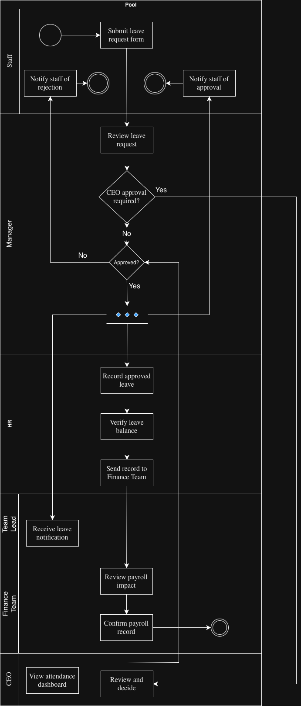
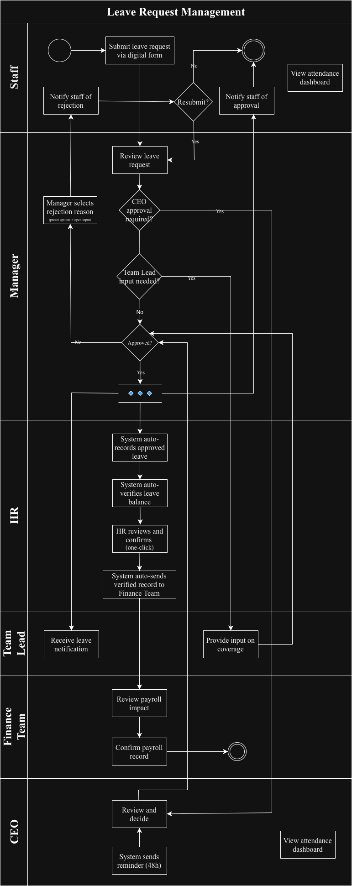

# Case Study: Automating Leave Request Management

**BA + Automation Portfolio — Chou Kimeng — June 2026**

This repository documents an AI-powered leave request automation prototype built with Make.com, Airtable, Groq AI, and Gmail.

## Repository Files

- `README.md` — case study overview
- `As-Is-BPMN.png` — as-is process map
- `To-Be-BPMN.png` — to-be process map
- `screenshots/` — Scenario 1 and Scenario 2 automation screenshots
- `Groq-System-Prompt.md` — standalone AI system prompt used by the Groq AI agent

## Business Problem

The HR department currently manages leave requests manually through email and spreadsheets. This causes processing delays of 3-5 days per request, frequent document loss, and payroll calculation errors due to miscommunication between HR and finance teams.

## Solution Overview

The proposed workflow replaces manual email handling with a structured digital leave request process:

1. Staff submit leave requests through an Airtable form.
2. Make.com triggers the automation flow.
3. Groq AI analyzes each request for risk, policy flags, escalation needs, and stakeholder communication.
4. Managers receive approval context and can approve or reject requests.
5. Staff, HR, and Team Leads receive automated notifications.
6. Dashboards provide visibility for staff, managers, and CEO-level review.

## Process Maps

## Key Requirements

- Digital leave request submission
- Automated manager notification
- CEO escalation for special cases or longer duration leave
- AI risk assessment and recommendation
- Approval/rejection notification flow
- Staff dashboard for request visibility
- CEO dashboard for leave trend monitoring
- HR and Finance handoff improvements

## Automation Architecture

**Tools:** Make.com, Airtable, Groq AI Llama 3.3 70B, Gmail

**Scenario 1:** New leave request intake, AI analysis, status update, employee directory lookup, and stakeholder notification.

**Scenario 2:** Post-decision notification workflow after manager approval or rejection.

## AI Agent Logic

The Groq AI agent performs:

- Escalation check
- Risk assessment
- Approval recommendation
- Policy flag detection
- Email drafting for manager, staff, HR, and team lead
- Reasoning summary

See [`Groq-System-Prompt.md`](Groq-System-Prompt.md).

## Screenshots

See the [`screenshots`](screenshots) folder for Scenario 1 and Scenario 2 evidence.

## ROI Summary

Estimated monthly time saved: **~10.4 hours**

Estimated annual cost saving: **~$2,136**

Estimated annual solution cost: **~$370**

Estimated ROI: **477%**

## Future Improvements

- Staff resubmission flow
- Role-based authentication for staff dashboard
- CEO approval interface
- 48-hour reminder scenarios
- HR one-click confirmation to Finance
- Payroll or HRIS integration
